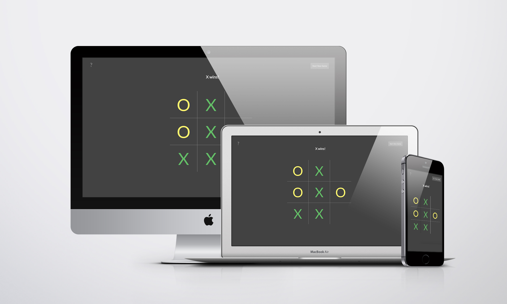

### Tic Tac Toe

The classic game of [Tic Tac Toe](https://en.wikipedia.org/wiki/Tic-tac-toe) game. Human vs. Computer.

<!--  -->

### The Logic

Each square is assigned a bit value with successive powers of 2:

```

  273        84
  |           |

  1  |  2  |  4   - 7
  --- ----- ----
  8  |  16 |  32  - 56
  --- ----- ----
  64 | 128 | 256  - 448

  |     |     |
  73   146   292

```

The cells each represent an individual bit in a 9-bit string:

```

  1   = 000000001
  2   = 000000010
  4   = 000000100
  ...
  256 = 100000000

```

Winning combinations will include the 3 winning bits:

```

  7   = 000000111
  56  = 000111000
  73  = 001001001
  ...
  448 = 111000000

```

Using the bitwise operation, we compare the user's total score with the winning combinations to check for 3 matching bits (ie. a winner):

Example scenario:

```

    000010111 (23)  // The user has a mark on the 1, 16, 4, & 2 squares
  & 000000111 (7)   // Three of the required bits match resulting in a winning row
    ---------
    000000111 (7)   // After evaluating the bit strings, a winning row is determined

```

### Local Setup

```
sass --watch scss/style.scss:css/style.css
```
